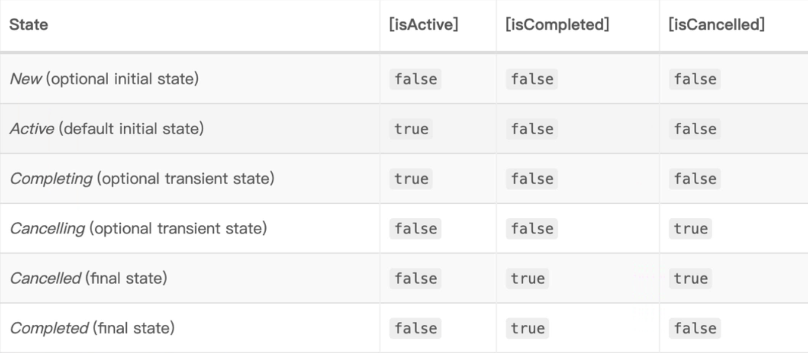

### 定义

- **让我们通过顺序的方式编写异步代码**

- 协程通过将复杂性放入库中来简化异步编程，程序的逻辑可以再协程中顺序的表达，而底层库会为我们解决其异步性
- 该库可以将用户代码的相关部分包装为回调、发布订阅相关事件，在不同线程（甚至不同机器）上调度执行，而代码则保持如果顺序执行一样简单。
- 协程就像非常轻量级的线程。线程是由系统调度的，线程切换或者线程阻塞的开销都比较大
- 而协程依赖于线程，但是协程挂起时不需要阻塞线程，几乎是无代价的，协程是由开发者控制的。所以协程也像用户态的线程，非常轻量级，一个线程中可以创建任意个协程。
- 总而言之：协程可以简化异步编程，可以顺序的表达程序，协程也提供了一种避免阻塞线程并用更廉价、更可控的操作代替线程阻塞的方法--协程挂起

### 重要概念

#### `CoroutineScope`

- 可以理解为协程本身，包含了`CoroutineContext`

#### `CoroutineContext`

- `CoroutineContext`，协程上下文，是一些元素的集合，主要包括`Job`和`CoroutineDispatcher`元素，可以代表一个协程的场景

####  `EmptyCoroutineContext`

- 表示一个空的协程上下文

#### `CoroutineDispatcher`

- `CoroutineDispatcher`，协程调度器，决定协程所在的线程或线程池。他可以指定协程运行于特定的一个线程、一个线程池或者不指定任何线程（这样协程就会运行于当前线程）
  - `coroutines-core`中`CoroutineDispatcher`有三种标准实现：`Dispatchers.Default`、`Dispatchers.IO`,`Dispathers.Main`和`Dispatchers.Unconfined`，`Unconfined`就是不指定线程
  - `launch`函数定义如果不指定`CoroutineDispatcher`或者没有其他的`ContinuationInterceptor`，默认的协程调度器就是`Dispatchers.Default`，`Default`是一种协程调度器，其指定的线程为共有的线程池，线程数量至少为2，最大与`CPU`数相同

#### `Job & Deferred`

- `Job`，任务，封装了协程中需要执行的代码逻辑，`Job`可以取消并且有简单地生命周期

  

- `Job`完成时没有返回值，如果需要返回值，应该使用`deferred`，它是`Job`的子类

  ```kotlin
  public interface Deferred<out T>: Job
  ```

#### `Coroutine builders`

- `CoroutineScope.launch`函数属于协程构建器`Coroutine builders`，`kotlin`中还有其他几种`Builder`，负责创建协程。

#### `CoroutineScope.launch`

- 是最常用的协程构建器，**不阻塞当前线程**，在后台创建一个新协程，也可以指定协程调度器

#### `runBlocking{}`

- `runBlocking{}`以创建一个新的协程同时**阻塞当前线程**，直到协程结束。这个不应该在协程中使用，主要是为`main`函数和测试设计的

#### `withContext{}`

- `withContext{}`不会创建新的协程，在指定协程上运行挂起代码块，并挂起该协程直至代码块运行完成

#### `async{}`

- `CoroutineScope.async{}`可以实现与`launch builder`一样的效果，在后台创建一个新协程，唯一的区别是它有返回值，因为`CoroutineScope.async{}`返回的是`Deferred`类型


